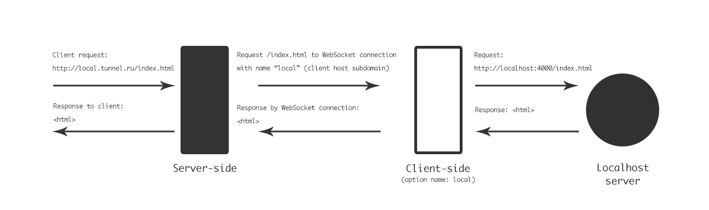

# WS-Tunnel

WebSocket tunnel from local machine to your global server.

## Scheme



## Server-side

Server start WebSocet server for local machine, and HTTP server for requests to local machine.

### Usage

Install module and run server.

Like localy npm mudule from module folder:
```
npm run server -- {options}
```

Like localy npm mudule:
```
$(npm bin)/ws-tunnel-server {options}
```

Like global mudule:
```
ws-tunnel-server {options}
```

### Options

* **-H, --host [host]** — Host of tunnel. Default `0.0.0.0`
* **-P, --port [number]** — Port of tunnel. Default `4488`
* **-h, --server-host [host]** — Host of listener server. Default `0.0.0.0`
* **-p, --server-port [number]** — Port of listener server. Default `4480`
* **-m, --mask [number]** — RegExp mask for searching tunnel name in server host. Default `(\\w+)\\.` (subdimain)
* **-t, --timeout [time]** — Connection and request timeout. Default `5000` (5 sec)
* **-s, --save** — Save current options as preset *(experimental)*
* **-l, --list** — List preset settings *(experimental)*


## Client-side

Server open WebSocket connection with server-side instance, and requests you local host.

### Usage

Install module and run server.

Like localy npm mudule from module folder:
```
npm run client -- {options}
```

Like localy npm mudule:
```
$(npm bin)/ws-tunnel {options}
```

Like global mudule:
```
ws-tunnel {options}
```

### Options

* **-n, --name [name]** — Name of tunnel. Default `local`
* **-h, --localhost [url]** — Host for tunneling. Default `http://locahlost:4000`
* **-t, --tunnel [url]** — Socket URL of tunnel. Default `ws://locahlost:4488`
* **-r, --reconnect [time]** — Time for reconnection. Default `5000` (5 sec)
* **-s, --save** — Save current options as preset
* **-l, --list** — List preset settings

